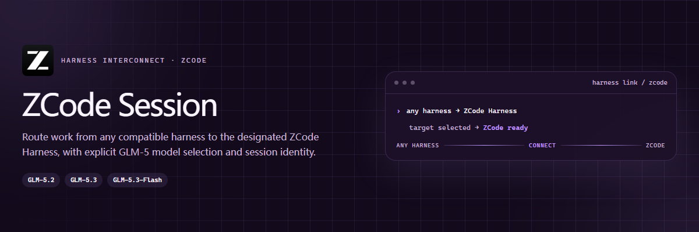

<p align="center">
  <picture>
    <source media="(max-width: 680px)" srcset="./assets/readme/hero-mobile.png">
    
  </picture>
</p>

<p align="center">
  <a href="https://github.com/ZiChenWang114514/codex-zcode-session/actions/workflows/ci.yml"></a>
  · Windows · Python 3.10+ · MIT
</p>

`codex-zcode-session` gives Codex a small, inspectable interface for local ZCode CLI work: check the active model without exposing credentials, run a headless task in an explicit directory, and resume one exact `sess_...` conversation.

## What is verified

| Check | Current evidence |
| --- | --- |
| Skill structure and Python wrapper | Validated in CI on Windows |
| ZCode runtime discovery | `zcode-app-cli 3.9.2-16`, runtime `0.16.5` |
| Model catalog | GLM-5.2, GLM-5.3 and GLM-5.3-Flash detected |
| Multimodal declaration | GLM-5.3-Flash declares image, PDF and video input |
| Live GLM response | Requires a configured Coding Plan key; catalog visibility alone does not prove access |

## Why this Skill exists

- **Exact sessions** — resume by full session ID and keep the original working directory.
- **Readable status** — see versions, selected models, multimodal entries and setup state as JSON.
- **Controlled execution** — choose `plan`, `build`, `edit` or `yolo` for each headless request.
- **Isolated verification** — the smoke test uses a temporary `ZCODE_HOME` and removes its test data afterward.
- **Prompt files** — keep long, multilingual instructions in UTF-8 files instead of wrestling with shell quoting.

## Quick start

### 1. Install ZCode CLI

This Skill targets [`zcode-app-cli`](https://github.com/kingsword09/zcode-cli), an unofficial terminal client for the official agent runtime distributed with ZCode Desktop.

```powershell
npm install -g zcode-app-cli@latest
zcode --version
```

Node.js 22.19 or newer is required. On Windows, open `zcode` once and configure a Z.AI or BigModel Coding Plan key through the masked setup interface.

### 2. Install the Skill

```powershell
git clone https://github.com/ZiChenWang114514/codex-zcode-session `
  "$env:USERPROFILE\.codex\skills\codex-zcode-session"
```

### 3. Inspect before prompting

```powershell
python "$env:USERPROFILE\.codex\skills\codex-zcode-session\scripts\zcode_session.py" `
  status --json
```

A useful first result contains:

```json
{
  "main_model": "zai/glm-5.3",
  "lite_model": "zai/glm-5.3-flash",
  "required_models_present": true,
  "model_access_configured": false
}
```

`model_access_configured: false` means the catalog is installed but no live model request should be reported as successful yet.

## Run a task

Use `plan` for read-only analysis:

```powershell
python .\scripts\zcode_session.py invoke `
  --dir C:\path\to\repo `
  --prompt "Inspect the failing tests and explain the cause." `
  --mode plan --json
```

Use a UTF-8 prompt file for implementation work:

```powershell
python .\scripts\zcode_session.py invoke `
  --dir C:\path\to\repo `
  --prompt-file .\phase-1.txt `
  --mode build --json
```

Continue the same conversation with its complete ID:

```powershell
python .\scripts\zcode_session.py invoke `
  --dir C:\path\to\repo `
  --session-id sess_example `
  --prompt-file .\phase-2.txt --json
```

The wrapper deliberately does not use ZCode's “latest session” shortcut.

## Model routing

| Role | Model | Input |
| --- | --- | --- |
| Primary work | `zai/glm-5.3` | Text |
| Lightweight and multimodal work | `zai/glm-5.3-flash` | Text, image, PDF, video |
| Compatibility option | `zai/glm-5.2` | Text |

Changing the user configuration affects newly created sessions. A resumed session may retain the model stored in its history.

## Verification workflow

1. Run `status --json` and confirm the executable, model IDs and credential state.
2. Review the target repository instructions, current changes and test commands.
3. Start `invoke` with an explicit directory, prompt and permission mode.
4. Inspect the actual file changes and run the repository's own tests.
5. Continue only with the exact session ID returned by the first call.

After model access is configured, run an isolated live check:

```powershell
python .\scripts\zcode_session.py smoke-test `
  --dir C:\safe\workspace --json
```

## Repository map

```text
codex-zcode-session/
├── SKILL.md                       Codex operating instructions
├── scripts/zcode_session.py       status, invoke and smoke-test commands
├── references/defaults.json       model and timeout defaults
├── references/operation-protocol.md
├── agents/openai.yaml             Codex UI metadata
└── tests/                          wrapper unit tests
```

## Safety notes

- Credentials are checked only as present or absent; their values are never printed.
- Timeout cleanup targets only the process started by the wrapper.
- The Skill does not commit, push, publish or alter unrelated files.
- A successful CLI exit still requires inspection of the repository changes and tests.

## License and status

MIT licensed. This project is independent of Z.ai and the `zcode-app-cli` maintainers. ZCode CLI behavior can change with the embedded runtime, so re-run `status` and the smoke test after upgrades.
